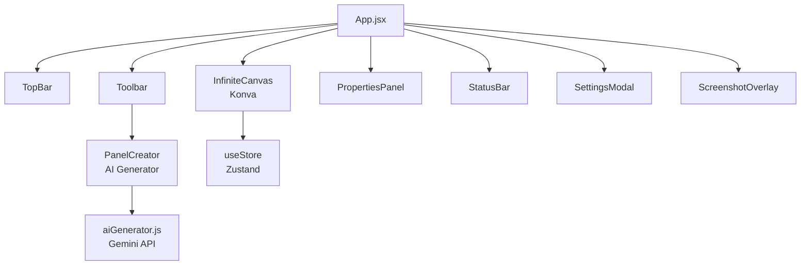

<p align="center">
  
</p>

<h1 align="center">InfinityBoard</h1>

<p align="center">
  <strong>Lienzo infinito con herramientas de IA para diseño y colaboración visual.</strong><br/>
  <em>Infinite canvas with AI tools for visual design and brainstorming.</em>
</p>

<p align="center">
  
  
  
  
  
</p>

---

## 🇪🇸 Español

### ¿Qué es InfinityBoard?

**InfinityBoard** es una aplicación de escritorio desarrollada por [CRTIC](https://crtic.cl) que ofrece un lienzo infinito para diseño y brainstorming visual. Combina herramientas de dibujo clásicas con generación de imágenes por IA, todo en una interfaz intuitiva y rápida.

### Características Principales

| Función | Descripción |
|---------|-------------|
| 🎨 **Lienzo Infinito** | Pan, zoom y navegación sin límites |
| ✏️ **Herramientas de Dibujo** | Pluma, líneas, flechas, rectángulos, círculos |
| 📝 **Texto y Notas** | Texto libre y sticky notes con personalización completa |
| 🤖 **Generador de IA** | Genera imágenes directamente en el canvas con Gemini |
| 📸 **Exportar Áreas** | Selecciona y exporta cualquier región del canvas |
| 💾 **Guardar y Cargar** | Persiste tus tableros localmente |
| 🧲 **Snap & Grid** | Alineación inteligente con grid configurable |
| ↩️ **Undo/Redo** | Historial completo de acciones |

### Arquitectura



### Instalación

```bash
# Clonar el repositorio
git clone https://github.com/techCRTIC/InfinityBoard.git
cd InfinityBoard

# Instalar dependencias
npm install

# Ejecutar en modo desarrollo
npm run dev
```

> **Nota:** Para las funcionalidades de IA, necesitas configurar tu API Key de Gemini en Settings (⚙️).

### Atajos de Teclado

| Atajo | Acción |
|-------|--------|
| `V` | Herramienta de selección |
| `T` | Herramienta de texto |
| `S` | Nota adhesiva |
| `R` | Rectángulo |
| `C` | Círculo |
| `P` | Pluma |
| `L` | Línea |
| `A` | Flecha |
| `G` | Panel Creator (IA) |
| `Ctrl+Z` | Deshacer |
| `Ctrl+Shift+Z` | Rehacer |
| `Ctrl+G` | Agrupar |
| `Delete` | Eliminar selección |
| `Space+Drag` | Paneo |
| `Scroll` | Zoom |

---

## 🇬🇧 English

### What is InfinityBoard?

**InfinityBoard** is a desktop application developed by [CRTIC](https://crtic.cl) that provides an infinite canvas for visual design and brainstorming. It combines classic drawing tools with AI image generation, all in a fast, intuitive interface.

### Key Features

| Feature | Description |
|---------|-------------|
| 🎨 **Infinite Canvas** | Pan, zoom and navigate without limits |
| ✏️ **Drawing Tools** | Pen, lines, arrows, rectangles, circles |
| 📝 **Text & Notes** | Free text and sticky notes with full customization |
| 🤖 **AI Generator** | Generate images directly on the canvas with Gemini |
| 📸 **Area Export** | Select and export any region of the canvas |
| 💾 **Save & Load** | Persist your boards locally |
| 🧲 **Smart Grid** | Smart alignment with configurable grid |
| ↩️ **Undo/Redo** | Full action history |

### Architecture


### Installation

```bash
# Clone the repository
git clone https://github.com/techCRTIC/InfinityBoard.git
cd InfinityBoard

# Install dependencies
npm install

# Run in development mode
npm run dev
```

> **Note:** For AI features, you need to set your Gemini API Key in Settings (⚙️).

### Keyboard Shortcuts

| Shortcut | Action |
|----------|--------|
| `V` | Selection tool |
| `T` | Text tool |
| `S` | Sticky note |
| `R` | Rectangle |
| `C` | Circle |
| `P` | Pen |
| `L` | Line |
| `A` | Arrow |
| `G` | Panel Creator (AI) |
| `Ctrl+Z` | Undo |
| `Ctrl+Shift+Z` | Redo |
| `Ctrl+G` | Group |
| `Delete` | Delete selection |
| `Space+Drag` | Pan |
| `Scroll` | Zoom |

---

## 🛠️ Pila Tecnológica / Tech Stack

- **Frontend:** React 18 + Vite
- **Motor de Canvas / Canvas Engine:** Konva.js (react-konva)
- **Gestión de Estado / State Management:** Zustand
- **Escritorio / Desktop Runtime:** Tauri v1
- **Animación / Animation:** Framer Motion
- **IA / AI:** Google Gemini API
- **Estilos / Styling:** Tailwind CSS + CRTIC Design System
- **Tipografía / Typography:** Manrope

---

## 📄 Licencia / License

MIT — ver [LICENSE](LICENSE) para detalles. / See [LICENSE](LICENSE) for details.

## 🤝 Contribuir / Contributing

Ver [CONTRIBUTING.md](CONTRIBUTING.md) | See [CONTRIBUTING.md](CONTRIBUTING.md)

---

<p align="center">
  Desarrollado para <a href="https://crtic.cl"><strong>CRTIC</strong></a> — Centro para la Revolución Tecnológica en Industrias Creativas<br/>
  <em>Developed for <a href="https://crtic.cl"><strong>CRTIC</strong></a> — Center for Technological Revolution in Creative Industries</em>
</p>
//crtic.cl"><strong>CRTIC</strong></a> — Centro para la Revolución Tecnológica en Industrias Creativas
</p>
